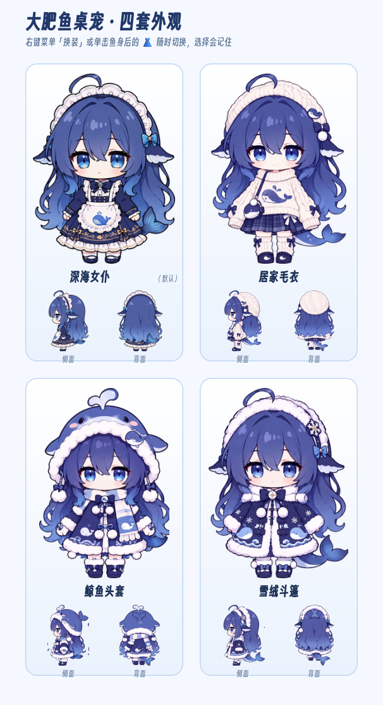
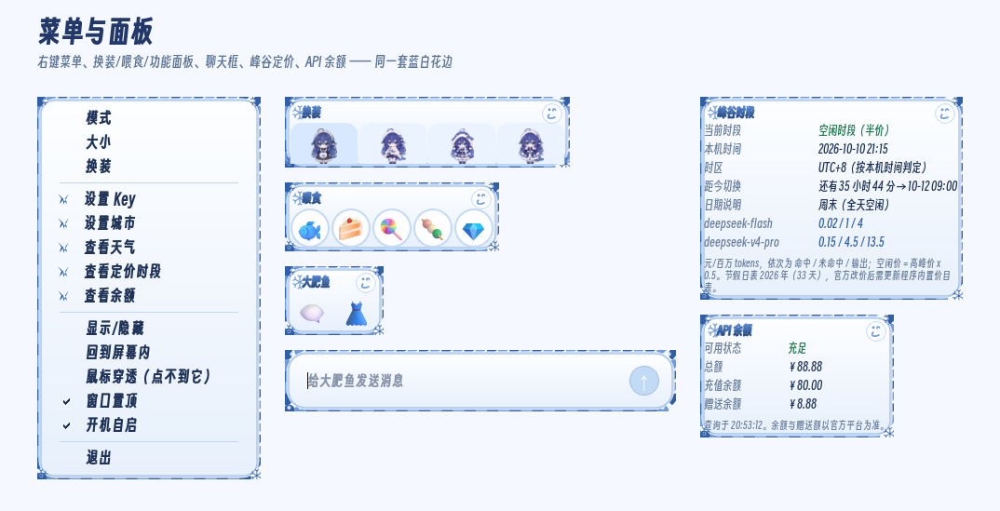

# 大肥鱼桌宠 🐋

DeepSeek V4 Pro 二创形象「鲸鱼娘·大肥鱼」的透明桌面宠物。

基于三视图素材（正面 / 侧面 / 背面），用 Python + PySide6 实现，无边框透明置顶窗口。






## 功能

- **三视图行走**：左右走用侧面（自动镜像）、向上走用背面、向下走用正面

- **三种模式**：自由散步 / 跟随鼠标 / 原地待着（右键菜单切换）

- **互动**：
  - 左键按住：拖拽（会侧身朝向拖动方向，松手会说话）
  - 单击：蹦跳 + 回嘴（互动台词）+ 弹出功能面板（🗨️ 聊天 / 👗 换装）
  - 双击：喂食面板（小鱼干 / 蛋糕 / 棒棒糖 / 团子 / 钻石）
  - 右键：完整菜单（模式 / 大小 / 换装 / 喂食 / 说句话 / 显示/隐藏 / 鼠标穿透 / 置顶 / 开机自启 / 退出；托盘右键是同款菜单，穿透后可从托盘解除）

- **换装（新增）**：「深海女仆」（最初的深蓝连衣裙形象）之外，还有「雪绒斗篷」「鲸鱼头套」两套三视图衣服，左右键菜单里都能切，切换有交叉淡化，选择记在 `config.json` 的 `outfit` 字段里，下次启动自动穿上

- **蓝白花边界面（新增）**：右键菜单、功能面板、喂食面板、换装面板、聊天输入框、说话气泡统一换成「蓝白雪绒」主题
  - 浮层外圈是手绘扇形花边 + 白色珠点 + 四角雪花，内层是蓝白渐变圆角卡片
  - 菜单项悬停/选中是浅蓝底 + 深蓝字，分隔线为淡蓝细线，「设置 Key / 城市 / 天气」带小鲸尾图标
  - 说话气泡也是花边卡片 + 下方小鲸尾；说话时气泡顶沿还有三片小雪花错相闪烁；心声（思维链）气泡用同款花边的灰调版本
  - **字体（内置，跟随程序走）**：`assets/fonts/` 里放任意 `.ttf/.otf` 就会**自动加载并优先使用**；随包附带**得意黑（Smiley Sans）**，简体风格圆体、SIL OFL 授权可免费商用/可再分发，覆盖项目全部常用字
    - 回退链：内置字体 → 幼圆 → 微软雅黑 → 华文细黑 → 系统默认；气泡 24px、菜单与面板 12pt
    - **加粗方式**：字重统一用 `Bold(700)`（Qt 只在 ≥700 时才对缺粗体字重的字体做合成加粗），文字另外用 `QPainterPath` 轮廓 + 细描边再补一圈厚度，所以小字号下也不显细
    - **渐变字**：气泡台词与面板标题都是**浅蓝→深蓝竖向渐变**（`TEXT_GRADIENT`，按整条气泡取一次渐变，多行文字连成一体）；心声（思维链）气泡保持灰调纯色，免得和正常台词混在一起
    - 换字体：把 `.ttf/.otf` 丢进 `assets/fonts/` 覆盖掉即可（文件名随意）；想保留系统幼圆就删掉 `assets/fonts/` 里的文件
    - 查看最终用的是哪个字体：`python 桌宠.py --font-check`（会打印内置字体、优先链、气泡/菜单字体与字重）
  - 配色与花边参数集中在 `桌宠.py` 顶部（`LACE_*` / `PANEL_*` / `TEXT_*` / `FONT_DIR` / `CUTE_FONT_CANDIDATES`）

- **台词系统**：日常随机台词 + 互动回嘴 + 思维链心声（灰色斜体括号气泡，小概率冒出），全部取材自社区 DS 梗

- **细节**：呼吸 / 摇摆 / 蹦跳 / 进食动画、转向交叉淡化、加减速惯性、散步自动休息、说话冷却

- 托盘图标、窗口置顶、鼠标穿透、开机自启、配置记忆（config.json）；穿透 / 置顶状态重启后自动恢复

- ##### AI 对话（新增）

  - 左键单击弹出 🗨️ 图标，点击后弹出聊天输入框
  - 调用 DeepSeek API（`deepseek-chat` 模型），每句话不超过 25 字，风格贱兮兮但可爱
  - 对话历史保留最近 40 条（自动记忆上下文）
  - API Key 通过右键菜单「设置 Key」输入，保存到 `config.json`
  - 聊天期间鱼会暂停移动，但呼吸/摇摆/小动作照常

  ##### 天气查询（新增）

  - 右键菜单「查看天气」→ 调用 `wttr.in` 获取当前城市天气
  - 城市默认从 `config.json` 读取，可手动修改配置文件中的 `"city"` 字段
  - 鱼会气泡播报：「汕头今天 26°，天气多云」

  ##### 系统状态监控（新增）

  - **CPU**：超过 90% 时冒泡提醒
  - **内存**：超过 95% 时冒泡提醒
  - **显卡（NVIDIA）**：温度超过 80°C 时冒泡提醒（`pynvml` 读取）
  - 检测间隔 10 秒，不频繁打扰

## 运行

需要 **Python 3.11+**

> **配置文件**：首次启动会自动生成 `config.json`（含 DeepSeek API Key、位置、外观等），
> 仓库里**不包含**它（已被 `.gitignore` 忽略），请参考 [config.example.json](config.example.json) 自行创建/填写。
> Key 也可以在程序里通过右键菜单「设置 Key」填入，不需要手改文件。

```bash
pip install -r requirements.txt
# 或
pip install PySide6
```

然后双击 `启动桌宠.bat`，或：

```bash
python 桌宠.py
```

## 打包成独立 exe（可分享给朋友）

```bash
pip install pyinstaller
pyinstaller --noconfirm --onefile --windowed --name 大肥鱼桌宠 --add-data "sprites;sprites" --icon icon.ico 桌宠.py
```

产物在 `dist/大肥鱼桌宠.exe`，对方双击即用，无需安装 Python。
（杀毒软件可能对 PyInstaller 产物误报，加信任即可。）

## 推送到自己的 GitHub 仓库

本仓库对应 `https://github.com/decade-0110/dafeiyu_pet.git`（工程文件在仓库根目录）。
代码更新后一条命令即可推送：

```bash
git push -f decade HEAD:refs/heads/main
```

- `git remote -v` 里 `decade` 指向上面那个仓库，`origin` 指向上游原项目 `1190fasheqi/dafeiyu-pet`，别推错。
- 首次推送会弹出 GitHub 登录（浏览器授权或粘贴 Personal Access Token），之后 Git 凭据管理器会记住。
- 如果你的网络需要代理（本机 git 配的是 `http://127.0.0.1:7890`），推送报 TLS/凭据类错误时加一个参数：
  `git -c http.sslBackend=openssl push -f decade HEAD:refs/heads/main`

## 更换形象

把新的三视图（白底）放到程序目录：

1. 正面.png / 侧面.png / 背面.png（原图）
2. 运行 `python preprocess.py` —— 白底抠图 + 统一高度
3. 运行 `python preprocess2.py` —— 边缘去污 + 预乘 alpha 缩放出各尺寸精灵

## 给桌宠加一套新衣服

新增的外观放在 `sprites/outfits/<id>/` 里，程序启动时自动发现，菜单里就会出现。

1. 准备一张（或三张）白底三视图原图，**并排三个姿势**：正面 / 侧面 / 背面（左右朝向的侧视图请保持和默认形象一致——默认的「深海女仆」侧面朝左）。
2. 先出预览检查抠图质量（棋盘格 / 白底 / 深底三行，方便看白边）：

```bash
python preprocess_outfits.py --id my_outfit --name 我的新衣服 --src "path\to\三视图.png" --preview --out build\outfit_preview
```

3. 预览没问题就正式生成精灵（会写 `sprites/outfits/my_outfit/` 和 `manifest.json`）：

```bash
python preprocess_outfits.py --id my_outfit --name 我的新衣服 --src "path\to\三视图.png" --out sprites\outfits
```

4. 重启桌宠（或右键菜单「换装」里选一下）。

常用参数：`--side-index 2` 指定第几格当侧面（默认 2）、`--flip-side` 给侧面做左右镜像、`--force` 覆盖已有精灵。

### 抠图方式：白底泛洪 或 rembg

默认走**白底泛洪**（不需要任何模型，离线可用）。也可以用 [rembg](https://github.com/danielgatis/rembg) 做 AI 抠图，边缘更稳：

```bash
pip install "rembg[cpu]"        # 注意要带 [cpu]，否则只有 rembg 本体、缺 onnxruntime 后端
python preprocess_outfits.py --id my_outfit --name 我的新衣服 --src "path\to\三视图.png" --rembg on
```

- `--rembg auto`（默认）：装了 rembg 就自动用，没装就用白底泛洪
- `--rembg on`：强制用 rembg（不可用时提示并退回白底泛洪）
- `--rembg off`：只用白底泛洪
- 首次运行 rembg 会自动下载 u2net 模型（约 170MB，存到 `~/.u2net/`）；rembg 报错时会自动回退白底泛洪，不会中断整批处理
自检：`python 桌宠.py --check` 会列出所有外观、每张精灵尺寸和各档位窗口宽高。

## 文件说明

| 文件 | 说明 |
|------|------|
| 桌宠.py | 主程序（全部逻辑，含换装） |
| preprocess.py | 白底三视图抠图脚本（遗留版，路径写死） |
| preprocess2.py | 精灵边缘去污 + 多尺寸生成脚本（遗留版，路径写死） |
| preprocess_outfits.py | 换装精灵生成脚本（切三视图 + 抠图 + 多尺寸 + manifest） |
| sprites/ | 默认外观「深海女仆」精灵图（正面/侧面/背面 各尺寸 + 图标） |
| sprites/outfits/ | 各套换装精灵（`<id>/` + `manifest.json`）；打包会自动带上 |
| assets/fonts/ | 内置字体（放 `.ttf/.otf` 即自动加载并优先使用；附得意黑 Smiley Sans，SIL OFL） |
| docs/ | README 展示图（三套外观 + 花边界面） |
| 启动桌宠.bat | 启动脚本（自动选择 venv 或系统 Python） |
| requirements.txt | 依赖 |
| 桌宠.spec | PyInstaller 打包配置（含新依赖收集） |

## 贡献与致谢

- **AI 对话 / 天气查询 / 系统监控 / PyInstaller 打包配置**：由 [Cpanoe](https://github.com/Cpanoe) 通过 [PR#3](https://github.com/1190fasheqi/dafeiyu-pet/pull/3) 贡献（DeepSeek API 聊天、wttr.in 天气、CPU/内存/GPU 监控、桌宠.spec）。
- 合并时维护方修复：
  - 线程安全：DeepSeek 回复由后台线程直接调用 Qt 界面改为经队列转发主线程（`_say_queue`）
  - 配置保护：`config.json` 保持不入仓库（本地配置含 API Key，防止泄露）
- 桌面宠物朝向修复由 [B-A-A-GE](https://github.com/B-A-A-GE) 通过 [PR#1](https://github.com/1190fasheqi/dafeiyu-pet/pull/1) 提交（未合并，当前为维护方修复版）。

## 台词梗来源

台词均取自 DeepSeek / 鲸鱼娘 / 大肥鱼社区梗（D指导去吃饭、吃白饭、梁文锋会议三连、"才不是大肥鱼"、思维链心声等），感谢社区整活。

## 协议

MIT

## 第三方资源

- **得意黑 Smiley Sans**（`assets/fonts/SmileySans-Oblique.ttf`）—— 由 [Atelier Anchor](https://github.com/atelier-anchor/smiley-sans) 开发，采用 [SIL Open Font License 1.1](https://scripts.sil.org/OFL) 授权，可免费商用、可随程序再分发。
